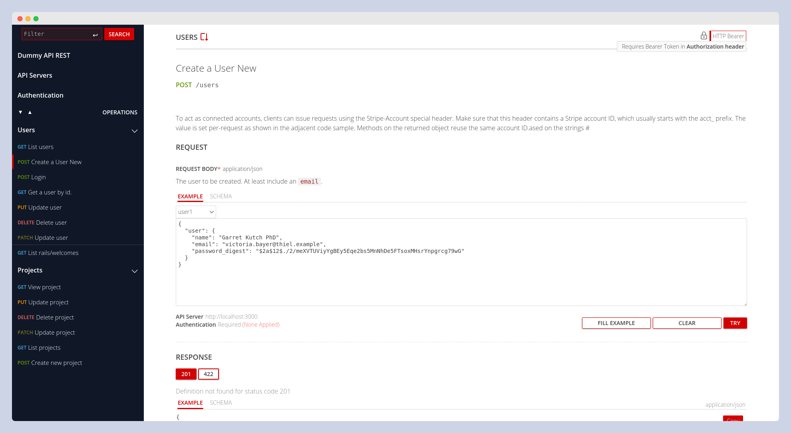

# Introduction

OasRails is a Rails engine that automatically generates OpenAPI 3.1 documentation from YARD comments in your Rails app, rendered with RapiDoc for interactive exploration.

### Key Features

- 🚀 **Automatic OAS 3.1 Generation**: OasRails scans your Rails application and generates OpenAPI specifications automatically.

- 📝 **YARD-Powered Documentation**: Use YARD tags in your endpoint comments to add descriptions, parameters, and examples—no need to learn a new DSL or use a specific framework (like Grape or RSpec).

- 🎨 **Interactive API Explorer**: Visualize and test your APIs in real-time with a polished UI powered by RapiDoc. If you prefer another UI, you can easily replace RapiDoc with alternatives like Swagger UI or ReDoc.

### Demo App

Explore the interactive documentation live:

🔗 **[Open Demo App](https://paso.fly.dev/api/docs)**  
👤 **Username**: `oasrails`  
🔑 **Password**: `oasrails`

